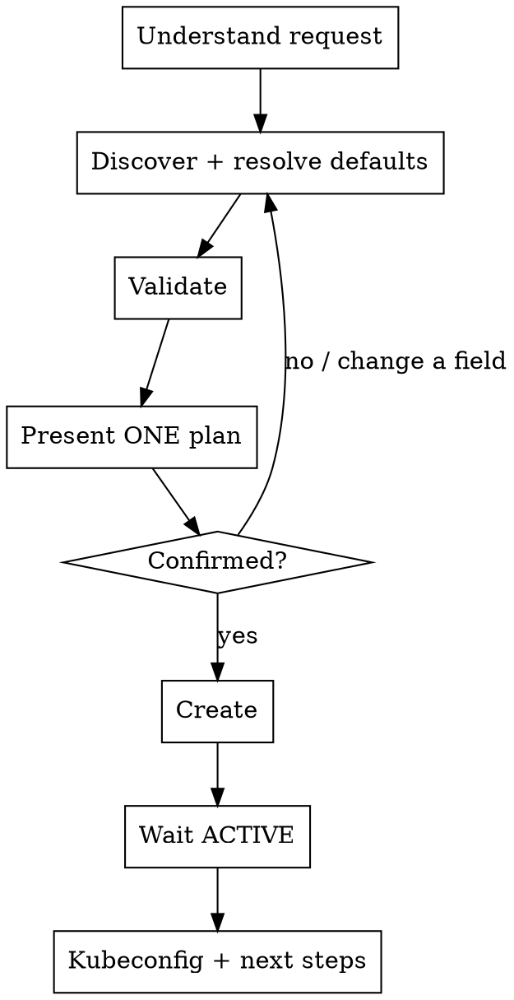

# Create a VKS Cluster

## Overview

Turn "I want a cluster" into a running VKS cluster. Default mode is **one-shot**: discover everything, auto-pick safe defaults, present a single plan, and create after one confirmation — like `eksctl create cluster --name foo`. The user can change any field, or switch to step-by-step ("detailed mode"), at any time.

**REQUIRED BACKGROUND:** Read `../vks/references/resource-defaults.md` — it defines the discovery tools, the default-picking policy, flavor-by-need selection, name validation, and the create-body shape. This skill assumes that policy.

## Prerequisites

- VKS MCP server running **with `--allow-write`** (creating is a write). If create fails as read-only, tell the user to restart it with `--allow-write`.
- Credentials + `project_id` configured (see `/vks`). If `get_access_token` or any discovery tool fails on auth/project_id, stop and route the user to `/vks` setup.

## The flow (Hybrid)



### Step 1 — Understand the request
Get the **cluster name** (required). **If the user didn't give one, ask for it first — it is the only mandatory question; don't ask for anything else upfront.** Note anything the user volunteers: region, "prod/HA", "GPU", a specific k8s version, a flavor, CALICO, etc. Don't interrogate — capture what's given and let defaults cover the rest.

If the name is invalid, propose the closest valid form and confirm (see name rules in the reference). Auto-propose the node-group name as `<cluster-name>-ng` (or `default-ng` if too long) per the reference.

### Step 2 — Discover and resolve defaults
Call discovery tools and apply the default-picking policy from the reference:
1. `cluster_versions_list` → pick the recommended STABLE version.
2. `vpc_list` → if exactly one, auto-pick; if several, ask by name.
3. `subnet_list` (chosen vpc) → default/only subnet, else ask.
4. `secgroup_list` → the project's `default` group unless the user wants another.
5. `sshkey_list` → the single configured key; if **none exists**, stop and tell the user to create one in the VNG Cloud console (do not invent an ID).
6. Flavor: take the small default unless the user wants to choose → then ask "what will this run?" and show `flavor_list` filtered by the matching `need` group.

Resolve any name the user gave to its ID. Map fields per the reference (VPC `id`→`vpcId`, subnet `uuid`→`subnetId`, flavor `flavorId`→`flavorId`, sshkey `id`→`sshKeyId`, secgroup `id`→`securityGroups[]`).

### Step 3 — Validate
Build the `CreateClusterComboDto` body (see reference) and call `cluster_create_validate`. If it reports problems, fix them and re-validate. This catches errors before the user confirms.

### Step 4 — Present ONE plan
Show a single table of every resolved field, marking each `[auto]` or `[you chose]`. For example:

```
Cluster plan:
| Field          | Value                          | Source        |
|----------------|--------------------------------|---------------|
| Name           | my-cluster                     | you chose     |
| Region         | HCM-3                          | [auto] default|
| K8s version    | v1.30.x (recommended, STABLE)  | [auto]        |
| Network type   | CILIUM_NATIVE_ROUTING          | [auto]        |
| VPC            | vpc-prod (net-…)               | [auto] only 1 |
| Subnet         | subnet-a (sub-…)               | [auto]        |
| Node group     | default-ng · 1 × 2c/4g · SSD 100GB · ubuntu | [auto] |
| SSH key        | my-key                         | [auto] only 1 |
| Security group | default                        | [auto]        |
```

Invite the user to change any field or say "detailed mode" to walk through each decision. Then apply the **HARD GATE**.

### HARD GATE — confirm before creating
Tell the user exactly what will be created and wait for an explicit confirmation keyword: `yes`, `confirm`, `ok`, `approve`, `proceed`, `go ahead`, `do it`, `lgtm`, or equivalent. ANY other response (a field change, a question, ambiguous text) is adjustment input — update the plan and re-present. NEVER treat a non-confirmation as approval.

### Step 5 — Create
Call `cluster_create` with the confirmed body. Report the returned cluster id/status.

### Step 6 — Wait for ACTIVE
The MCP server has no waiter. Poll `cluster_get` per the "Waiting for ACTIVE" policy in the reference (~30s interval, ~15 min timeout, report each status change). On ERROR or timeout, surface `cluster_get_events` and point the user to the console. See the reference's status table for what each state means.

### Step 7 — Kubeconfig + next steps
Once ACTIVE, call `cluster_get_kubeconfig` and give the user the kubeconfig, with a note to merge it into `~/.kube/config` (e.g. save and `KUBECONFIG=... kubectl get nodes`). Offer next steps: add another node group (`/vks-nodegroup`), or inspect status (`/vks-explore`).

## Common situations

| Situation | Do |
|-----------|----|
| User just says "create a cluster called X" | One-shot: discover, default everything, present plan, confirm. |
| "for production" / "HA" | Suggest 3 nodes; keep other defaults; still confirm. |
| "with GPU" / "for AI" | Use `flavor_list need=AI/GPU`; let user pick. |
| "use CALICO" | Set networkType=CALICO and require a `cidr` (offer `10.96.0.0/12`). |
| No SSH key exists | Stop; direct user to create one in the console; don't fabricate. On resume, re-run `sshkey_list` with `refresh: true` (cache won't show the new key yet). |
| Server is read-only | Explain `--allow-write` is needed; don't attempt create. |
| Validation keeps failing on `diskType` | `SSD` is the default; if rejected, ask the user for a `vtype-…` disk-type id. |

## Common mistakes
- Asking the user for raw IDs instead of resolving names via discovery tools.
- Skipping `cluster_create_validate` and hitting errors after confirmation.
- Creating before an explicit confirmation, or treating a question as approval.
- Declaring success at `cluster_create` — the cluster isn't usable until ACTIVE and kubeconfig is delivered.
